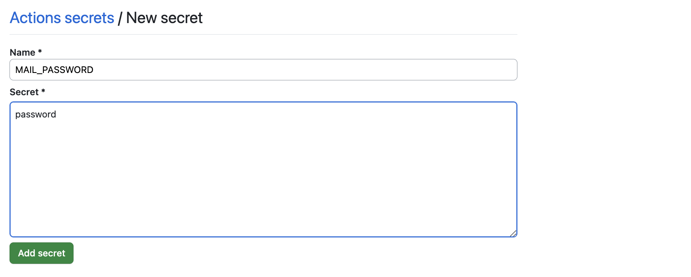
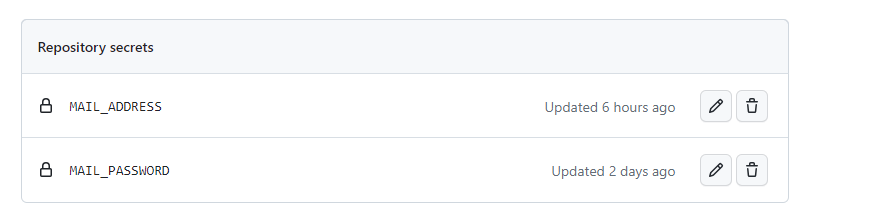

# JBNU-NoticeLetter


## Setting
⚠️ 본 저장소를 클론하고 개별 설정한 이후 사용할 수 있습니다.

### GMail

<details>
<summary> 메일 발신자에 한해 보안설정 2차 인증이 필요합니다.</summary>

1. 구글 계정관리에 들어가 왼쪽에 보안 메뉴를 클릭합니다.   
2. 2단계 인증 부분을 완료해줍니다.
   
   
   
3. '메일', 'window컴퓨터'를 선택하고 앱 비밀번호를 설정합니다.
   
   

4. 생성된 비밀번호를 복사합니다.
   
  
</details>

### EMail Information
- ⚙︎ Settings - (Security) Secrets and variables - Actions - New repository secret
- Name이 'MAIL_SENDER', 'MAIL_PASSWORD', 'MAIL_RECEIVER'인 변수에 알맞은 값을 넣어 만들기
  - MAIL_SENDER: 메일 발신자
  - MAIL_PASSWORD: 발신자의 메일 비밀번호
  - MAIL_RECEIVER: 메일 수신자

  <details>
     <summary> 설정화면</summary>
     
  
  
  </details>
  
### Keyword 
- [crawler.py](https://github.com/riverallzero/JBNU-NoticeLetter/blob/main/crawler.py): line 11에 원하는 키워드 입력하기

  ```python
  # ================================================
  # KEYWORD ========================================
  # ================================================
  
  keyword = '안내'
  ```

### Reset last_no.txt
- [last_no.txt](https://github.com/riverallzero/JBNU-NoticeLetter/blob/main/last_no.txt): 최신 공지 번호 0으로 설정하기

### Cron(option)
- 코드 실행 주기 커스터마이징 하기
- UTC TimeZone으로 한국과 -9시간 차이
- [python-package.yml](https://github.com/riverallzero/JBNU-NoticeLetter/blob/main/.github/workflows/python-package.yml): line 11에 원하는 시간 설정하기

  ```yaml
    schedule:
    - cron:  "0 1,3,5,7,9 * * *" # UTC TZ(korea time - 9)
  ```
