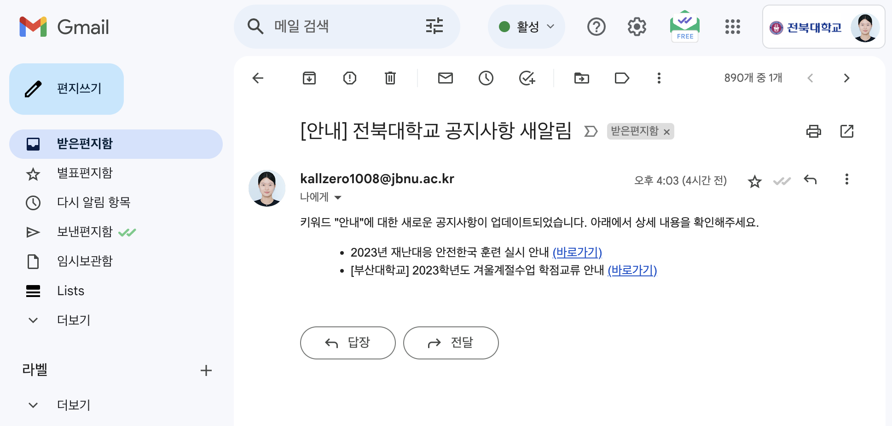
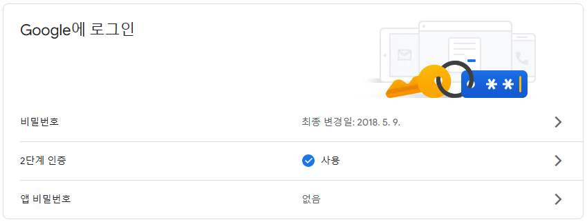
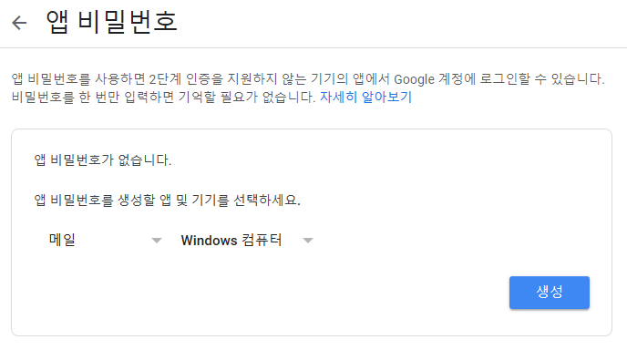
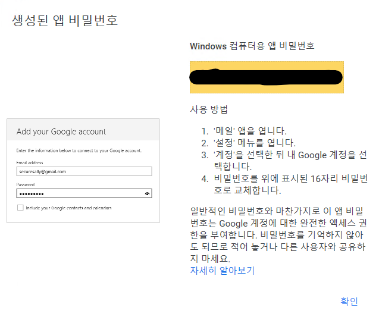
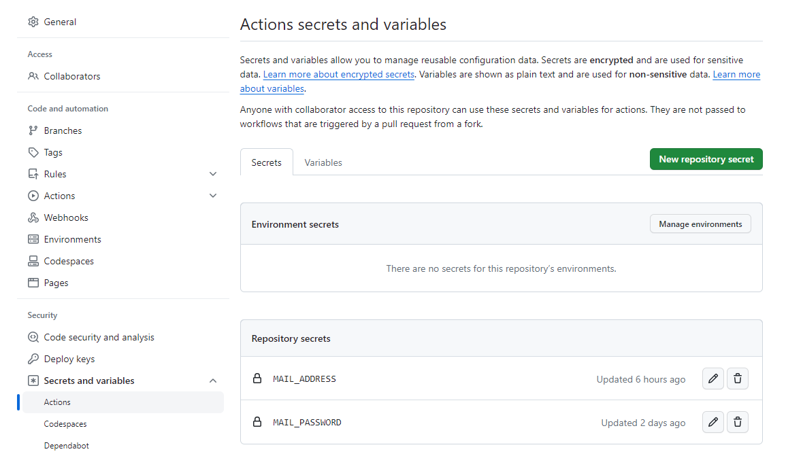

# JBNU-NoticeLetter


## Setting
- 본 저장소를 클론하고 개별 설정한 이후 사용할 수 있습니다.
- 현재 코드는 Gmail만 사용 가능합니다.
- 아래 필수 4가지 설정과 1가지 옵션을 확인하세요.
  
### 1. GMail

- 메일 계정의 보안설정(2차 인증)이 필요합니다.
  
<details>
<summary> 일반 구글 계정</summary>

1. 구글 계정관리에 들어가 왼쪽에 보안 메뉴를 클릭합니다.   
2. 2단계 인증 부분을 완료해줍니다.

   
   
3. '메일', 'window컴퓨터'를 선택하고 앱 비밀번호를 설정합니다.
   
   

4. 생성된 비밀번호를 복사합니다.
   
   
</details>

<details>
  <summary>학교 계정</summary>

  - [보안 수준이 낮은 앱의 액세스](https://myaccount.google.com/lesssecureapps?pli=1&rapt=AEjHL4PZOeH6jzDHnTrdcpZ50qdFHgN6WEJmb5muJvWQP3DuLHQx5-M0abBYO6Jy1kx119Iu_cjOYxHbYej7So53JyXUaw29CQ) 앱 허용: 사용으로 설정합니다.

  
</details>

### 2. EMail Information
- ⚙︎ Settings - (Security) Secrets and variables - Actions - New repository secret
- Name이 'MAIL_ADDRESS', 'MAIL_PASSWORD'인 변수(주소, 비밀번호)에 알맞은 값을 넣어 만들기
  - MAIL_ADDRESS: 메일 주소
  - MAIL_PASSWORD: 메일 비밀번호
  
  

### 3. Reset
[last_no.txt](https://github.com/riverallzero/JBNU-NoticeLetter/blob/main/last_no.txt) 파일 삭제하기

### 4. Keyword 
- [crawler.py](https://github.com/riverallzero/JBNU-NoticeLetter/blob/main/crawler.py): line 11에 원하는 키워드 입력하기 (예. ['벨트'], ['벨트', '연수', '특강'] 등)

  ```python
  # KEYWORD ========================================
  # ================================================
  
  keywords = ['안내', '공고']
  ```

### Cron(option)
- 코드 실행 주기 커스터마이징 하기
- UTC TimeZone으로 한국과 -9시간 차이
- [python-package.yml](https://github.com/riverallzero/JBNU-NoticeLetter/blob/main/.github/workflows/python-package.yml): line 11에 원하는 시간 설정하기

  ```yaml
    schedule:
    - cron:  "0 1,3,5,7,9 * * *" # UTC TZ(korea time - 9)
  ```
