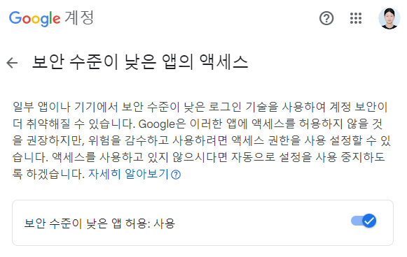
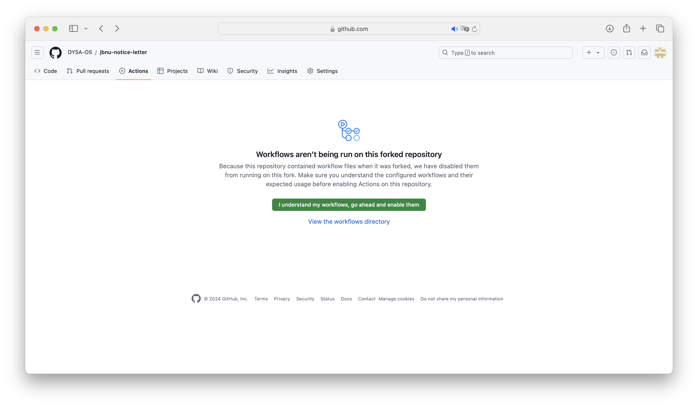
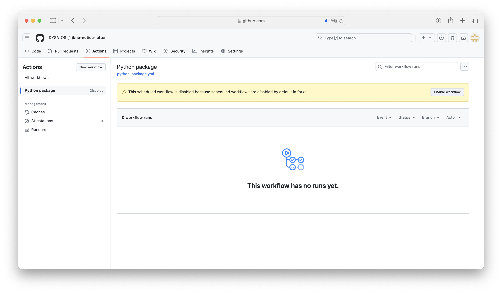

# JBNU-NoticeLetter
- [전북대학교 공지사항](https://www.jbnu.ac.kr/kor/?menuID=139)에서 원하는 키워드가 포함된 공지사항이 올라올 때 gmail로 관련 정보를 받아볼 수 있습니다. 
- 저장소를 **clone**하고 몇 가지의 설정을 마친 이후 사용할 수 있습니다. 
- 서비스를 이용하기 위해서 아래 **setting** 부분을 순서대로 따라주세요.

## Setting  
### 0. Fork
### 1. GMail: jbnu.ac.kr

[보안 수준이 낮은 앱의 액세스](https://myaccount.google.com/lesssecureapps?pli=1&rapt=AEjHL4PZOeH6jzDHnTrdcpZ50qdFHgN6WEJmb5muJvWQP3DuLHQx5-M0abBYO6Jy1kx119Iu_cjOYxHbYej7So53JyXUaw29CQ) &rarr; 앱 허용: 사용으로 설정합니다.



### 2. Github Secrets
- Settings > (Security) Secrets and variables > Actions > ```New repository secret```
- Name이 'MAIL_ADDRESS', 'MAIL_PASSWORD'인 변수 생성
  - MAIL_ADDRESS(변수 이름): 메일 주소(변수 값)
  - MAIL_PASSWORD(변수 이름): 메일 비밀번호(변수 값)
  


### 3. Custom Keywords
- [crawler.py](https://github.com/riverallzero/JBNU-NoticeLetter/blob/main/crawler.py): line 11에 원하는 키워드 입력 (예. ['벨트'], ['연수', '특강'] 등)

  ```python
  keywords = ['안내']
  ```
  
### 4. Activate Actions
Actions > ```I understand my workflows, go ahead and enable them``` > Python package > ```Enable workflow```



## Result

